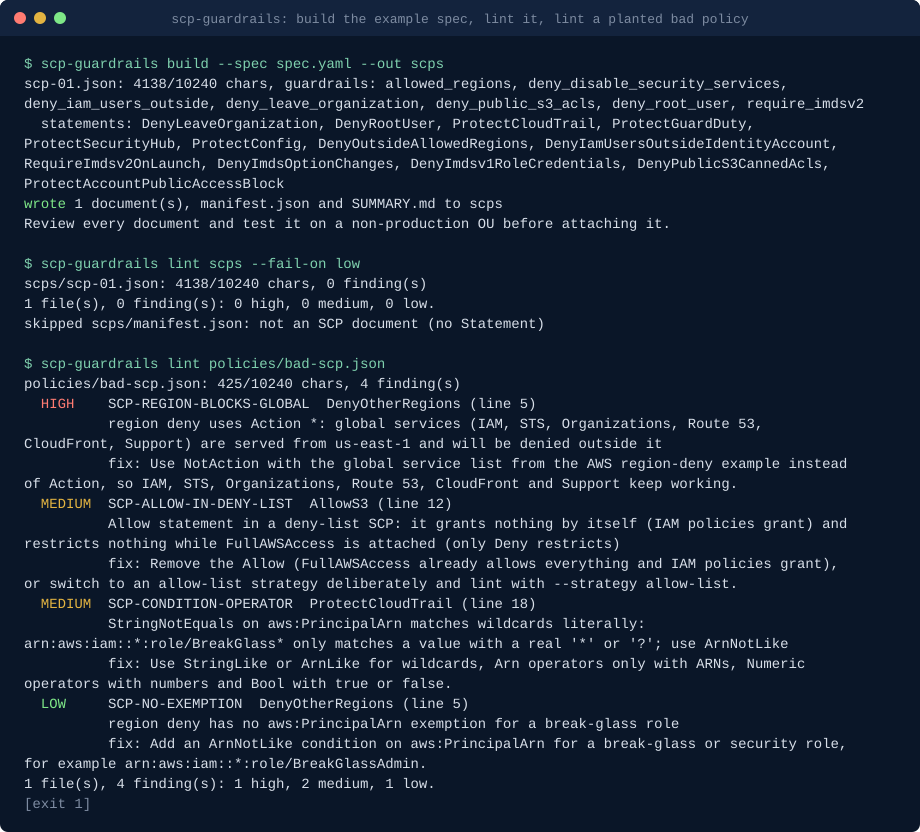

# scp-guardrails: AWS service control policy builder and linter

**scp-guardrails builds AWS Organizations service control policies from a short spec (region allowlist, protected roles, deny leaving the org, deny disabling CloudTrail and GuardDuty, deny root, require IMDSv2, deny public S3 ACLs, spend denies) under the SCP size limit, lints existing SCPs for the mistakes that lock you out or do nothing, and runs as a GitHub Action.**

[](https://github.com/basitalisandhu/scp-guardrails/actions/workflows/ci.yml)
[](https://github.com/basitalisandhu/scp-guardrails/actions/workflows/self-test.yml)
[](LICENSE)
[](pyproject.toml)

```bash
pipx install git+https://github.com/basitalisandhu/scp-guardrails
scp-guardrails build --spec examples/spec.yaml --out scps
scp-guardrails lint scps/
```

## Demo



Generated from the committed example spec and fixtures by [`scripts/render_demo.py`](scripts/render_demo.py); run `python3 scripts/render_demo.py` to regenerate it.

## What it is, who it is for, and why

Service control policies are the guardrails of an AWS organization: they cap what every user and role in a member account can do, whatever IAM says. They are also easy to get wrong in ways that only show up after they are attached. A region deny written with `Action: "*"` stops IAM and STS outside `us-east-1`. A `StringNotEquals` exemption with a `*` in the role ARN exempts nobody. A deny with no exemption cuts off the role the management account uses to get into the account. A statement whose condition can never be true denies nothing and looks fine in review.

scp-guardrails is for cloud and platform engineers who run multi-account AWS organizations, and for the reviewers who approve SCP changes in pull requests.

- `build` turns a short YAML or JSON spec into deny-list SCP documents. Each guardrail in the [catalogue](docs/catalog.md) is one spec key. Statements are packed into as few documents as fit under the size limit, measured on the compact JSON form AWS counts, and the build refuses to need more documents than one target can take. It writes a Markdown summary of what each statement denies and its known side effects.
- `lint` checks existing SCPs (plain JSON or `aws organizations describe-policy` output) against 20 rules: lockouts of the management account's access role, region denies that break global services or miss entries of the AWS example list, Allow statements in deny-list SCPs, `NotAction` misuse, missing break-glass exemptions, mismatched condition operators, conditions that can never be true, size, duplicate and malformed Sids. Table, JSON or SARIF output.
- `diff` compares two SCPs statement by statement and by action set, ignoring order, action case and whitespace.
- `explain` prints a plain-English account of what a policy denies, for reviewers.
- `catalog` prints the guardrail catalogue with the AWS documentation for each guardrail.

Standard library only, Python 3.11 or newer, no network access. It never calls AWS: it reads files and writes files. The builder and linter are extracted from aws-security-skills (the `scp-guardrails` skill in [aws-security-skills](https://github.com/basitalisandhu/aws-security-skills), which keeps its own copy); this repository turns them into a standalone package with more lint rules, a diff, an explainer and a GitHub Action.

## Install

Requires Python 3.11 or newer and has no runtime dependencies.

```bash
pip install scp-guardrails                                                              # once published to PyPI
pipx install git+https://github.com/basitalisandhu/scp-guardrails                        # the scp-guardrails command, isolated
uvx --from git+https://github.com/basitalisandhu/scp-guardrails scp-guardrails --help   # run without installing
```

Container image: each release tag publishes `ghcr.io/basitalisandhu/scp-guardrails` for linux/amd64 and linux/arm64. It runs as uid 1000 in `/work`:

```bash
docker run --rm -v "$PWD:/work" ghcr.io/basitalisandhu/scp-guardrails:0.1.0 build --spec spec.yaml --out scps
docker run --rm -v "$PWD:/work:ro" ghcr.io/basitalisandhu/scp-guardrails:0.1.0 lint policies/
```

## GitHub Action

Lint the SCPs in a repository on every pull request and see findings in the Security tab:

```yaml
name: SCP lint
on:
  pull_request:
    paths: ["policies/**"]
permissions:
  contents: read
  security-events: write   # for the SARIF upload
jobs:
  lint:
    runs-on: ubuntu-latest
    steps:
      - uses: actions/checkout@3d3c42e5aac5ba805825da76410c181273ba90b1 # v7.0.1
        with:
          persist-credentials: false
      - uses: basitalisandhu/scp-guardrails@v0.1.0   # pin to the release commit SHA in production
        with:
          path: policies/**/*.json
          fail-on: medium
          break-glass-roles: |
            BreakGlassAdmin
```

| Input | Default | What it does |
| --- | --- | --- |
| `path` | `**/scp*.json` | Glob, directory or file to lint; several, one per line. Non-SCP JSON found by a glob or directory is skipped. |
| `fail-on` | `high` | Lowest severity that fails the job: `low`, `medium`, `high` or `none`. |
| `sarif` | `true` | Write a SARIF 2.1.0 report. |
| `sarif-file` | `scp-guardrails.sarif` | Where to write it. |
| `upload-sarif` | `true` | Upload it to code scanning (needs `security-events: write`). |
| `category` | `scp-guardrails` | Code scanning category. |
| `break-glass-roles` | empty | Role names every `aws:PrincipalArn` exemption must cover, one per line. |
| `management-account` | empty | Management account id, to flag conditions that name it. |
| `python-version` | empty | Install this Python first; empty uses the runner's `python3` (3.11 or newer). |

Outputs: `finding-count`, `highest-severity`, `gate` (`pass` or `fail`), `file-count` and `sarif-file`. The linter runs from the Action's own checkout with the runner's Python, so nothing is installed from a package index. The SARIF upload uses `github/codeql-action/upload-sarif` pinned by commit SHA, and the job summary lists every finding.

## Quickstart

1. Copy [examples/spec.yaml](examples/spec.yaml) and edit it: your regions, your break-glass role names, your identity account id.

   ```yaml
   allowed_regions: [ap-southeast-2, us-east-1]
   protected_roles: [OrganizationAccountAccessRole, BreakGlassAdmin]
   deny_leave_organization: true
   deny_disable_security_services: true
   deny_root_user: true
   deny_iam_users_outside: ["111122223333"]
   require_imdsv2: true
   deny_public_s3_acls: true
   ```

2. Build: `scp-guardrails build --spec spec.yaml --out scps`. You get `scps/scp-01.json` (and more if the statements do not fit in one), `manifest.json` and `SUMMARY.md`. Exit 1 means a generated document failed lint and nothing was written; exit 2 means the spec is wrong.
3. Read `SUMMARY.md` with whoever owns the accounts. Every statement lists its side effects.
4. Lint what you already have: `scp-guardrails lint existing/ --fail-on medium`. Add `--break-glass-role BreakGlassAdmin` to check every exemption covers it, and `--management-account <id>` to catch conditions about the management account.
5. Before you replace a live SCP: `scp-guardrails diff live.json scps/scp-01.json`.
6. Attach to an OU with one non-production account first, test the workloads there, then widen.

Sandbox OUs can add spend denies; see [examples/sandbox-spec.yaml](examples/sandbox-spec.yaml).

## When to use this

- **How do I write an SCP that restricts AWS regions without breaking IAM?** Set `allowed_regions` in the spec. The builder uses `NotAction` with the global service list from the AWS example and exempts your `protected_roles`; `lint` flags region denies that use `Action: "*"` (SCP-REGION-BLOCKS-GLOBAL).
- **Will this SCP lock us out?** `scp-guardrails lint policy.json`. SCP-DENY-ALL, SCP-MGMT-LOCKOUT and SCP-REGION-BLOCKS-GLOBAL are the high-severity lockouts.
- **Why does my SCP not deny anything?** SCP-CONDITION-NEVER-TRUE and SCP-CONDITION-OPERATOR find conditions that cannot match and wildcards under exact-match operators.
- **My SCP is over the size limit.** `build` packs statements into several documents; `lint` reports the compact size of each file.
- **What changed between the SCP in production and the one in this pull request?** `scp-guardrails diff old.json new.json`, or `aws organizations describe-policy` output on either side.
- **Can CI block a risky SCP change?** Use the Action with `fail-on: medium`; findings appear in code scanning and in the job summary.

## Guardrail catalogue

Every guardrail is a Deny; none grants anything. Full detail, side effects and AWS documentation links: [docs/catalog.md](docs/catalog.md), or `scp-guardrails catalog`.

| Spec key | Statements | What it denies |
| --- | --- | --- |
| `deny_leave_organization` | DenyLeaveOrganization | `organizations:LeaveOrganization` |
| `deny_root_user` | DenyRootUser | every action by the member-account root user |
| `deny_disable_security_services` | ProtectCloudTrail, ProtectGuardDuty, ProtectSecurityHub, ProtectConfig | stopping or deleting CloudTrail, GuardDuty, Security Hub and AWS Config |
| `allowed_regions` | DenyOutsideAllowedRegions | every action outside the listed regions, except global services |
| `deny_iam_users_outside` | DenyIamUsersOutsideIdentityAccount | IAM user, login profile and access key creation outside the listed accounts |
| `require_imdsv2` | RequireImdsv2OnLaunch, DenyImdsOptionChanges, DenyImdsv1RoleCredentials | launches without IMDSv2, metadata option changes, IMDSv1 role credentials |
| `deny_public_s3_acls` | DenyPublicS3CannedAcls, ProtectAccountPublicAccessBlock | public canned ACLs and changes to the account public access block |
| `require_instance_tag` | RequireTagOnLaunch | instance launches without the named tag |
| `deny_instance_types` | DenyExpensiveInstanceTypes | listed (or default large, GPU and bare-metal) instance types |
| `allowed_instance_types` | DenyInstanceTypesNotAllowed | every instance type not listed |
| `max_volume_iops` | DenyHighIopsVolumes | EBS volumes above the IOPS number |
| `deny_volume_types` | DenyProvisionedIopsVolumeTypes | listed EBS volume types |
| `sagemaker_instance_types` | DenySageMakerGpuInstanceTypes | SageMaker GPU and accelerator instance types |
| `deny_bedrock_customization` | DenyBedrockCustomizationAndThroughput | Bedrock model customization jobs and provisioned throughput |
| `deny_services` | DenyExpensiveServices | every action of the listed services |
| `deny_commitments` | DenyPurchaseCommitments | reserved capacity, Savings Plans and Marketplace subscriptions |
| `protect_budgets` | ProtectBudgetsAndAnomalyMonitors | changing budgets, budget actions and cost anomaly monitors |

Options: `protected_roles` (role names exempt from every guardrail that takes an exemption, as `ArnNotLike` on `aws:PrincipalArn`), `max_policy_chars` (default 10240) and `max_documents` (default 9: ten directly attached SCPs per target, one of them FullAWSAccess).

## Lint rules

Details and examples: [docs/rules.md](docs/rules.md).

| Rule | Severity | Finds |
| --- | --- | --- |
| SCP-STRUCTURE | high | malformed policy or statement |
| SCP-SIZE | high | compact form over the size limit |
| SCP-PRINCIPAL | high | `Principal` or `NotPrincipal`, which SCPs do not support |
| SCP-DENY-ALL | high | `Deny *` on `*` with no condition |
| SCP-REGION-BLOCKS-GLOBAL | high | region deny with `Action: "*"` or a global service, breaking IAM, STS and Organizations |
| SCP-MGMT-LOCKOUT | high | unconditional deny of `sts:AssumeRole` or role administration, which cuts off the management account's access role |
| SCP-VERSION | medium | `Version` other than `2012-10-17` |
| SCP-ALLOW-IN-DENY-LIST | medium | `Allow` statements in a deny-list SCP |
| SCP-ALLOW-NOTACTION | medium | `Allow` with `NotAction` |
| SCP-DENY-NOTACTION-BARE | medium | `Deny` with `NotAction` and no condition |
| SCP-REGION-GLOBAL-GAPS | medium | region deny missing core global services |
| SCP-BREAK-GLASS-NOT-EXEMPT | medium | exemption that does not cover a named break-glass role |
| SCP-MGMT-ACCOUNT-REF | medium | condition naming the management account, where SCPs never apply |
| SCP-CONDITION-OPERATOR | medium | wildcard under `StringEquals`, `Arn` operator on a non-ARN, non-numeric `Numeric` value, unknown operator |
| SCP-CONDITION-NEVER-TRUE | medium | condition that can never match, so the statement denies nothing |
| SCP-DUPLICATE-SID | medium | two statements with the same `Sid` |
| SCP-NOTACTION-SCOPE | low | `Deny` with `NotAction` scoped by something other than region |
| SCP-REGION-DOC-GAPS | low | region deny missing entries of the AWS example list |
| SCP-NO-EXEMPTION | low | region or security-service guardrail with no break-glass exemption |
| SCP-SID-FORMAT | low | `Sid` with characters IAM does not accept |

## Commands

| Command | What it does | Exit codes |
| --- | --- | --- |
| `build --spec FILE [--out DIR] [--format text\|json\|markdown] [--pretty] [--max-chars N]` | Build SCP documents, `manifest.json` and `SUMMARY.md`. | 0 built, 1 lint failure, 2 bad spec |
| `lint PATH... [--format table\|json\|sarif] [--fail-on low\|medium\|high\|none] [--sarif FILE] [--limit N] [--strategy deny-list\|allow-list] [--break-glass-role NAME] [--admin-role NAME] [--management-account ID]` | Lint files, directories or globs. | 0, 1 findings at or above `--fail-on`, 2 bad input |
| `diff A B [--format text\|json]` | Semantic diff by statement and action set. | 0 identical, 1 different, 2 bad input |
| `explain POLICY [--format text\|markdown]` | Plain-English narrative. | 0, 2 bad input |
| `catalog [--format table\|json\|markdown] [--key KEY]` | The guardrail catalogue. | 0, 2 unknown key |

Every command has `--help`. `python -m scp_guardrails` works too.

## What this is not

- **Not a replacement for testing policies in a sandbox OU.** The linter reads JSON; it does not evaluate requests against the full AWS authorization logic, and it cannot know which services your workloads call. AWS recommends testing SCPs on an OU before attaching them to the root ([Service control policies](https://docs.aws.amazon.com/organizations/latest/userguide/orgs_manage_policies_scps.html)).
- **Not a control for the management account.** SCPs do not affect users or roles in the management account, or service-linked roles ([same page](https://docs.aws.amazon.com/organizations/latest/userguide/orgs_manage_policies_scps.html)). Protect the management account by other means.
- **Not a deployment tool.** It writes files. Attaching policies is `aws organizations create-policy` and `attach-policy`, Terraform, CloudFormation or your landing zone tooling.
- **Not a complete list of global services.** The region guardrail uses the AWS example list, and AWS notes that the example might not include every new global service ([the example](https://github.com/aws-samples/service-control-policy-examples/blob/main/Region-controls/Deny-access-to-AWS-based-on-the-requested-AWS-region.json)).
- **Not an IAM policy linter.** Rules are written for SCP semantics (deny-list strategy, no principals, the management account exemption).

## Frequently asked questions

**What is the SCP size limit?**
The AWS Organizations [quotas page](https://docs.aws.amazon.com/organizations/latest/userguide/orgs_reference_limits.html) gave 10,240 characters per SCP and 10 SCPs attached directly to a root, OU or account when checked on 2026-10-04. Older guides, including the skill this tool was extracted from, use 5,120 characters and 5 policies. Both figures are settings: `max_policy_chars` and `max_documents` in the spec, `--limit` for `lint`. All characters count, so `build` measures the compact form; upload the files as written.

**Does whitespace count?**
Yes. AWS counts every character, and suggests removing whitespace outside quotation marks when a policy nears the limit. `build` writes compact JSON unless you pass `--pretty`.

**Why is my break-glass role still denied?**
Usually the exemption uses `StringNotEquals` with a wildcard, which matches literally (SCP-CONDITION-OPERATOR), or the role has a path (`role/admin/BreakGlass`) the pattern does not cover. Lint with `--break-glass-role NAME` to check every exemption.

**Can it read policies straight from my organization?**
Not by itself; it never calls AWS. Save `aws organizations describe-policy --policy-id p-... --output json` to a file and lint that file; the `Content` string is parsed.

**Does it support allow-list strategies?**
`lint --strategy allow-list` stops reporting Allow statements as mistakes. `build` only writes deny-list guardrails.

**Is it safe to run on policies that contain account ids?**
It makes no network calls and writes only the files you name. SARIF and job summaries contain statement ids and messages, which can include role names and account ids from your policies.

**How does it relate to aws-security-skills?**
The builder, the original twelve lint checks and the catalogue come from the `scp-guardrails` skill in [aws-security-skills](https://github.com/basitalisandhu/aws-security-skills), and the spend denies from its `aws-spend-guardrails` and `sandbox-account-guardrail-pack` skills. Those skills are unchanged; this package is the standalone version for CI and for people who do not use an AI coding assistant.

## Contributing

Issues and pull requests are welcome, in particular SCPs that lint wrongly (a false positive or a missed lockout) with a minimal policy that shows it, and guardrails worth adding to the catalogue with the AWS documentation behind them. Run `make check` (ruff and pytest) before opening a pull request and read [CONTRIBUTING.md](CONTRIBUTING.md). [docs/good-first-issues.md](docs/good-first-issues.md) lists six scoped starting points. Security problems: see [SECURITY.md](SECURITY.md).

## Related projects

- [aws-security-skills](https://github.com/basitalisandhu/aws-security-skills): AWS security skills for Claude Code, including the skill this tool was extracted from.
- [agent-threat-model](https://github.com/basitalisandhu/agent-threat-model): deterministic threat models for AI agent systems, with SARIF output.
- [basitalisandhu.github.io](https://basitalisandhu.github.io/): docs hub with a page per project.
- More from the same maintainer: [github.com/basitalisandhu](https://github.com/basitalisandhu).

## Licence

MIT, see [LICENSE](LICENSE). Copyright 2026 Muhammad Basit Ali.
